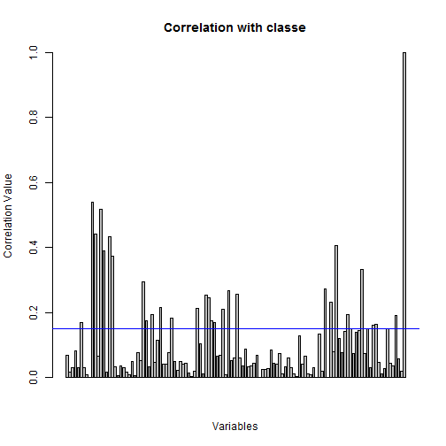

Data Analysis- Weight Llifting Exercise
========================================================
In this report, data from weight lifting exercise dataset is analyzed. The objective is to find whether a given volunteer has performed a given exercise according to the specified instructions to quantify how "well" the exercise is carried out. The output of whether an exercise is done well is stored in variable "classe" where 'A' means the exercise is done well and letters 'B' to 'E' imply the exercise is not done according to the instructions.

The data is loaded. The training data has 19622 observations of 162 variables. 

In order to calssify the test data, a model needs to be developed using the training data. To achieve that, it is important to appreciate that not all 160 variables may contribute anything significant to the classification of output variable 'classe'. Therefore, a correlation matrix is found for all those variables which passed the complete.case test.

From the correlation matrix, the following barplot is generated which shows how classe variable is linked to other variables.


 

The threshold is applied at 0.15 (the blue horizontal line). As can be seen from the barplot there are a significant number of variables that may have an affect on classe outcome based on the variables with correlation coefficient of at least 0.15. They are:


```
## Warning: package 'caret' was built under R version 3.1.3
```

```
## Loading required package: lattice
## Loading required package: ggplot2
```

```
## Warning: package 'ggplot2' was built under R version 3.1.3
```

```
## Warning: package 'rattle' was built under R version 3.1.3
```

```
## Rattle: A free graphical interface for data mining with R.
## Version 3.4.1 Copyright (c) 2006-2014 Togaware Pty Ltd.
## Type 'rattle()' to shake, rattle, and roll your data.
```

```
##  [1] "max_picth_belt"       "amplitude_pitch_belt" "var_total_accel_belt"
##  [4] "stddev_roll_belt"     "var_roll_belt"        "stddev_pitch_belt"   
##  [7] "var_pitch_belt"       "var_accel_arm"        "accel_arm_x"         
## [10] "magnet_arm_x"         "amplitude_yaw_arm"    "pitch_forearm"       
## [13] "max_roll_forearm"     "min_roll_forearm"     "total_accel_forearm" 
## [16] "avg_pitch_forearm"    "stddev_yaw_forearm"   "var_yaw_forearm"
```

```
## Loading required package: rpart
```

```
## Warning in nominalTrainWorkflow(x = x, y = y, wts = weights, info =
## trainInfo, : There were missing values in resampled performance measures.
```

```
## n= 406 
## 
## node), split, n, deviance, yval
##       * denotes terminal node
## 
## 1) root 406 887.93100 2.827586  
##   2) amplitude_pitch_belt< 3.5 337 563.34120 2.448071  
##     4) amplitude_pitch_belt< 2.5 319 519.02190 2.407524 *
##     5) amplitude_pitch_belt>=2.5 18  34.50000 3.166667 *
##   3) amplitude_pitch_belt>=3.5 69  38.98551 4.681159 *
```

 


You can also embed plots, for example:


```r
plot(cars)
```

 

